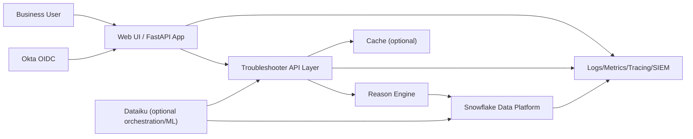

# Production Deployment Design

## 1) Executive Summary

This document defines a production deployment design for the Sales Order Schedule Troubleshooter with:

- Role-based access control (RBAC)
- Okta authentication and enterprise SSO
- Snowflake as the system of record for production data
- Multiple deployment options, including Dataiku-centric and hybrid patterns

The design keeps the current business behavior (snapshot troubleshooting, deterministic reason logic) while adding enterprise-grade security, reliability, and operations.

## 2) Scope and Non-Goals

### In Scope

- Production architecture for web/API tiers, identity, and data access
- RBAC model and permission boundaries
- Okta OIDC design and session/token flow
- Snowflake integration pattern and governance controls
- Deployment options comparison and recommended baseline
- Testing, cutover, run operations, and rollback model

### Out of Scope

- Full code-level implementation details for each service
- SAP-side source extraction redesign
- Enterprise IAM policy authoring in Okta/Snowflake admin consoles

## 3) Target Architecture

## 4) Authentication and RBAC Design

### Okta Authentication

- OIDC Authorization Code + PKCE for interactive web login
- Corporate SSO via Okta
- Token/session controls:
  - secure HTTP-only cookies
  - short token lifetime
  - refresh/session policy per enterprise standard
- Required identity claims: `sub`, `email`, `name`, `groups` (or custom role claim)

### RBAC Role Model

- **Admin**: operational controls and role governance
- **Analyst**: full troubleshooting and analysis features
- **Support**: troubleshooting + support handoff actions
- **ReadOnly/Audit**: view-only, no actioning

### Role-to-Access Principles

- Enforce permissions at API layer (mandatory) and UI layer (assistive)
- Map Okta groups to app roles at login/session issuance
- Re-evaluate role claims on session refresh

## 5) Snowflake Data Architecture

### Data Contract Objects

Production equivalents of current logical entities:

- `sales_orders`
- `sales_order_items`
- `sales_order_schedules`
- `stock_supply`
- `allocations`
- `deliveries`
- `planned_orders`
- `bop_logs`
- `plant_substitutions`

Prefer curated secure views for application reads.

### Security and Governance

- Dedicated app service identity with least privilege
- Role separation:
  - `ROLE_SO_APP_READ`
  - `ROLE_SO_DATA_ENG`
  - `ROLE_SO_AUDIT`
- Use Snowflake masking/row access policies where needed
- No direct reads from raw landing schemas

### Performance Pattern

- Dedicated warehouse for app traffic
- Parameterized queries and pushdown filters
- Pagination/limits for user-facing queries
- Optional short-lived app cache for repeated reads

## 6) Deployment Options (Including Dataiku)

- **Option A**: Container platform + Snowflake
- **Option B**: Managed app runtime + Snowflake
- **Option C**: Dataiku-centric runtime + Snowflake
- **Option D (Recommended)**: Dataiku pipelines + dedicated FastAPI serving tier + Snowflake

### Recommended Baseline

Use **Option D (Hybrid)**:

- Dataiku manages pipeline orchestration and curated data publication
- FastAPI service handles user session, RBAC, and response performance
- Snowflake is the shared governed contract between both

## 7) Security and Compliance Controls

- Vault/KMS-managed secrets and rotation
- TLS, secure cookies, and controlled network access
- Immutable audit logs with retention controls
- Data classification, masking, and access policy checks
- Threat scenarios tracked: auth bypass, over-privileged roles, data exfiltration

## 8) Reliability and Operations

- HA deployment (multi-instance, health checks, autoscaling)
- Blue/green or canary deployment strategy with rollback gates
- Observability: logs, metrics, traces, and alerting
- Runbooks and on-call ownership defined by platform/app/data teams

## 9) Testing and Cutover

Testing coverage:

- TUT (logic/authz/query paths)
- FUT (role-based UI/API behavior)
- Integration (Okta, Snowflake, Dataiku publish contract)
- Security and performance validation

Environment progression:

- `DEV` -> `QA` -> `UAT` -> `PRD`

Cutover gate examples:

1. RBAC and Okta acceptance complete
2. Snowflake contract and reconciliation approved
3. Security checks and performance thresholds passed
4. Rollback drill completed

## 10) 30/60/90-Day Roadmap

- **0-30**: architecture decisions, identity setup, Snowflake contracts, secret model
- **31-60**: RBAC implementation, Snowflake integration, observability controls
- **61-90**: UAT/security/load, pilot rollout, production launch and hypercare

## 11) Ownership Model

- Product owner: business acceptance and scope
- App engineering: runtime and authorization logic
- Data engineering/Dataiku: pipelines and curated Snowflake objects
- Security/IAM: Okta and policy governance
- Operations/SRE: deployment, monitoring, incident management

## 12) Implementation Runbook Reference

Use `PRODUCTION_IMPLEMENTATION_STEPS.md` as the execution checklist for:

- replacing sample datasets with Snowflake curated objects
- onboarding Okta OIDC authentication and claims mapping
- enforcing RBAC aligned to Snowflake least-privilege roles
- production hardening, go-live, and post-go-live operations.
